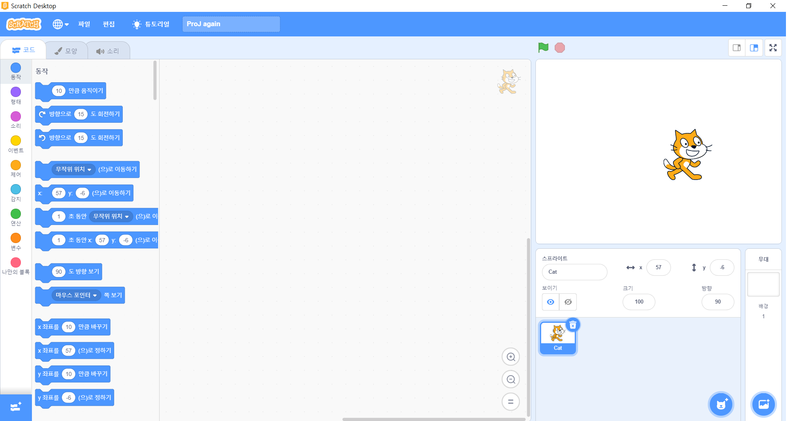

# scratch

스크래치를 활용하여 간단한 게임을 만들어 보겠습니다.  
방향 키 조작을 통해 캐릭터를 움직이며, 퀴즈를 맞추는 형식의 게임입니다.  

### 스프라이트 만들기
스크래치를 다운받은 후 실행했을 때의 첫 화면은 다음과 같습니다.

여기서 기존의 고양이 스프라이트(캐릭터)를 삭제하고 날아가는 모양의 스프라이트로 대체하겠습니다.

기존의 고양이 스프라이트를 삭제한 후, 우측하단의 '스프라이트 고르기' 아이콘을 클릭하여 'Cat Fyling'을 검색하여 선택해 줍니다.   
좌측상단의 '모양'에서 확인해보면 위와 같이 'cat flying-a', 'cat flying-b'가 추가된 것을 확인할 수 있습니다.

마찬가지 방법으로 'Glass water', 'Monkey' 스프라이트를 생성해줍니다.

### 배경 만들기
